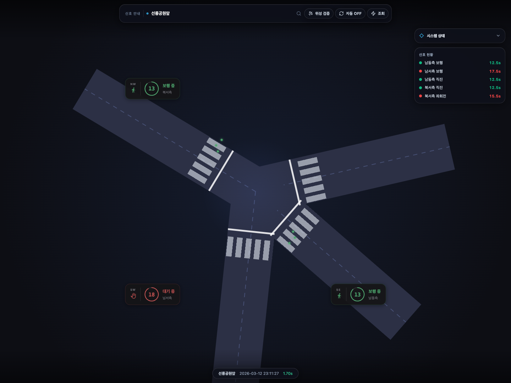
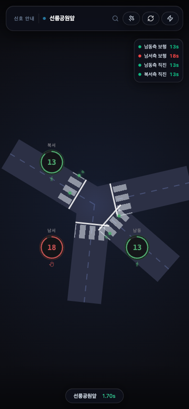

# Head Start

서울 교차로 신호 잔여시간 확인 서비스. T-Data V2X SPaT API 기반.

[](https://head-start-seven.vercel.app)

| 데스크탑 | 모바일 |
| -------------------------------------------------------------------------- | ----------------------------------------------------------------------- |
|  |  |

---

## 배경

T-Data V2X SPaT API를 통해 서울 교차로의 신호 잔여시간을 조회할 수 있다는 걸 알게 되어 만든 프로젝트. "다음 신호까지 몇 초?"를 실시간으로 보여주는 게 목표입니다.

`data/data.json`은 T-Data에서 제공하는 서울시 V2X 교차로 목록을 내려받아 로컬에 저장. (2026-01 기준, 997개). 이 목록은 교차로 ID·이름·좌표 인덱스로 사용됩니다.

---

## 기능

- **교차로 찾기** — 이름, ID, 현재 위치 기준으로 원하는 교차로를 고를 수 있다
- **신호 확인** — 현재 켜진 신호와 남은 시간을 방향별로 보여준다
- **교차로 시각화** — 도로 방향을 다이어그램과 지도로 같이 확인할 수 있다

---

## 기술 스택

|          |                                                                   |
| -------- | ----------------------------------------------------------------- |
| Frontend | Next.js 14 (Pages Router) · TypeScript · Tailwind CSS · shadcn/ui |
| Backend  | Vercel Serverless Functions                                       |
| 데이터   | T-Data V2X SPaT · OpenStreetMap Nominatim / Overpass              |
| 시각화   | SVG 다이어그램 · Leaflet                                          |
| 테스트   | Jest · Testing Library                                            |
| 검증     | Python · OpenCV · ffmpeg                                          |

---

## 실행

```bash
npm install
npm run build:data-index   # data/data.json → lib/itst-meta.json 경량 인덱스 생성
npm run dev
```

> `data/data.json`은 서울시 교차로 메타 스냅샷이다. 현재 저장본은 997건이다.

### 환경변수

| 변수                         | 필수 | 설명                         |
| ---------------------------- | ---- | ---------------------------- |
| `TDATA_API_KEY`              | ✅   | T-Data 주 API 키             |
| `SPAT_ALLOWED_IPS`           |      | 허용 IP 목록                 |
| `SPAT_RATE_LIMIT_MAX`        |      | IP당 최대 요청 수 (기본 120) |
| `SPAT_RATE_LIMIT_WINDOW_SEC` |      | 윈도우 초 (기본 60)          |

---

## 프로젝트 구조

```
pages/
  index.tsx                    교차로 목록 + 검색
  guide.tsx                    사용 가이드
  api/
    spat.ts                    신호 데이터 프록시 (핵심)
    nearby.ts                  위치 기반 교차로 검색
    geocode.ts                 주소 → 좌표
    ip-location.ts             IP 기반 위치 (3개 provider fallback)
    itst-meta.ts               교차로 메타 단건 조회
    intersection-geometry.ts   OSM 도로 bearing 계산
    search-intersections.ts    이름/ID 검색
components/
  IntersectionView.tsx         SVG 교차로 다이어그램
  BearingVerifyMap.tsx         Leaflet 위성 검증 지도
  SignalCountdownCard.tsx      카운트다운 카드
  OnboardingTour.tsx           첫 진입 가이드 투어
hooks/
  useInstallPrompt.ts          PWA 설치 프롬프트 훅
  useLocationBootstrap.ts      IP/GPS 위치 공통 훅
  useSpat.ts                   신호 데이터 페칭
  useNearby.ts                 근처 교차로 페칭
lib/
  types.ts                     전역 타입
  logger.ts                    서버/API 로그 유틸
  defaults.ts                  기본 상수
  ui.ts                        UI 보조 유틸
  utils.ts                     haversine · bearing · 타이밍 파싱
  itstMeta.ts                  교차로 메타 로더 (서버 전용)
data/
  data.json                    원본 교차로 메타 (현재 997건)
  itst-meta.json               경량 인덱스 (prebuild 생성)
```

---

## API

| 엔드포인트                       | 설명          | 파라미터          |
| -------------------------------- | ------------- | ----------------- |
| `GET /api/spat`                  | 신호 잔여시간 | `itstId`          |
| `GET /api/nearby`                | 근처 교차로   | `lat`, `lon`, `k` |
| `GET /api/geocode`               | 주소 → 좌표   | `q`               |
| `GET /api/ip-location`           | IP 기반 위치  | —                 |
| `GET /api/search-intersections`  | 이름/ID 검색  | `q`               |
| `GET /api/intersection-geometry` | 도로 bearing  | `itstId`          |
| `GET /api/itst-meta`             | 교차로 메타   | `itstId`          |
