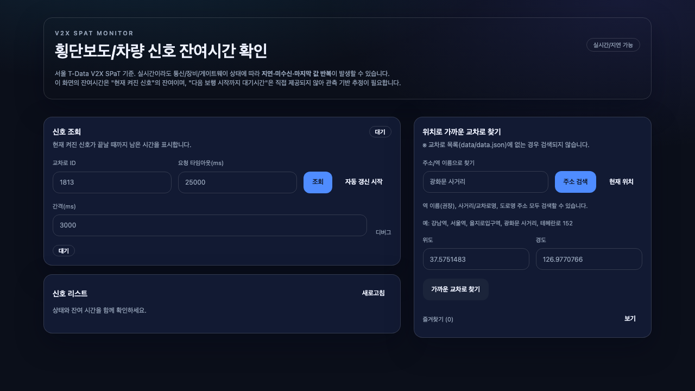

# Head Start

**서울 교차로 신호 잔여시간 확인 서비스** — CCTV 교차검증으로 데이터 정확도를 실증한 V2X 프로젝트

[](https://head-start-seven.vercel.app)



## 프로젝트 소개

서울시 T-Data V2X SPaT API가 제공하는 **2,800개 교차로 신호 데이터**를 활용해, 실시간 잔여시간 카운트다운을 보여주는 웹 서비스입니다.

단순히 API를 붙인 게 아니라, **UTIC CCTV 영상 분석으로 API 데이터의 정확도를 독립 검증**했습니다.

### 핵심 검증 결과

| 지표                         | 결과                              |
| ---------------------------- | --------------------------------- |
| API 잔여시간 vs CCTV 실측    | **MAE 0.79초** (장안교, dual ROI) |
| API 사이클 vs CCTV 사이클    | **오차 0.3초** (안국동사거리)     |
| "다음 보행 시작" 추정 정확도 | **MAE 0.58초** (정지→보행 전이)   |
| 검증 교차로                  | 5곳 (3곳 확정, 2곳 near-lock)     |
| CCTV-교차로 매칭             | 103쌍 (80m), S티어 5곳            |
| 연구 규모                    | 57개 실험 기록, 수천 회 API 호출  |

---

## 주요 기능

- **실시간 신호 카운트다운** — 보행/차량/좌회전/유턴 등 방향별 잔여시간
- **SVG 교차로 시각화** — 도로 방위각 기반 동적 다이어그램
- **위치 기반 검색** — GPS/IP/주소로 근처 교차로 탐색
- **모바일 퀵 뷰** — 원터치 조회에 최적화된 `/quick` 페이지
- **위성 지도 검증** — Leaflet 기반 도로 bearing 시각 확인
- **3개 API 키 자동 폴백** — 429 발생 시 sub → sub2 순차 전환
- **데이터 신선도 표시** — 3초 초과 시 "실시간성 미달" 경고

---

## 기술 스택

| 계층          | 기술                                                               |
| ------------- | ------------------------------------------------------------------ |
| **Frontend**  | Next.js 14 (Pages Router) · TypeScript · Tailwind CSS · shadcn/ui  |
| **Backend**   | Vercel Serverless Functions (7개 API 라우트)                       |
| **데이터**    | T-Data V2X SPaT API · OpenStreetMap Nominatim/Overpass             |
| **시각화**    | SVG 교차로 다이어그램 · Leaflet 위성 지도                          |
| **검증 스택** | Python · OpenCV · ffmpeg (CCTV ROI 분석)                           |
| **테스트**    | Jest · fetch mock 유틸                                             |

---

## CCTV 교차검증 연구

이 프로젝트의 차별점은 **API 데이터를 맹신하지 않고 독립 검증**한 것입니다.

### 검증 방법

```
서울 UTIC CCTV 스트림 (HLS/RTMP)
  → OpenCV ROI 픽셀 색상 추적
  → 신호 전환 시점 추출
  → T-Data API 잔여시간/상태와 시간축 대조
```

### 주요 발견

1. **잔여시간 ≠ 전체 사이클** — API `remain`은 현재 phase의 남은 시간이지, 교차로 전체 주기가 아님
2. **이중 모드 사이클** — 같은 교차로에서 시간대에 따라 160초/176초 두 가지 주기가 번갈아 출현
3. **CCTV-API 지연** — CCTV 스트림은 API 대비 약 13초(±4초) 뒤처짐
4. **"다음 보행 시작" 조건부** — `stop-And-Remain` 상태에서만 `remain ≈ 다음 초록불까지` 성립 (MAE 0.58초)
5. **dual ROI 방식** — 단일 ROI는 RED-only/GREEN-only 퇴화 문제 → 빨강+초록 전구 동시 관측으로 해결

---

## 빠른 시작

```bash
# 1. 의존성 설치
npm install

# 2. 데이터 인덱스 빌드
npm run build:data-index

# 3. 환경 변수 설정
cp .env.example .env.local   # 없으면 직접 생성
# TDATA_API_KEY=your-key-here

# 4. 개발 서버
npm run dev
```

### 환경 변수

| 변수                         | 필수 | 설명                           |
| ---------------------------- | ---- | ------------------------------ |
| `TDATA_API_KEY`              | ✅   | T-Data 주 API 키               |
| `TDATA_API_KEY_SUB`          |      | 폴백 키 (429 시 자동 전환)     |
| `TDATA_API_KEY_SUB2`         |      | 2차 폴백 키                    |
| `SPAT_ALLOWED_IPS`           |      | 허용 IP 목록 (쉼표/공백 구분)  |
| `SPAT_RATE_LIMIT_MAX`        |      | IP당 최대 요청 수 (기본 120)   |
| `SPAT_RATE_LIMIT_WINDOW_SEC` |      | 레이트리밋 윈도우 초 (기본 60) |

### 명령어

```bash
npm run dev              # 개발 서버 (localhost:3000)
npm run build            # 프로덕션 빌드 (prebuild 자동 포함)
npm test                 # 테스트 실행
npm run build:data-index # data.json → itst-meta.json 인덱스 생성
```

---

## 프로젝트 구조

```
pages/
  index.tsx              교차로 목록 + 검색 (홈)
  quick.tsx              모바일 퀵 조회
  view.tsx               교차로 시각화 + 위성 검증
  demo.tsx               데모 시나리오 뷰어
  guide.tsx              사용 가이드
  api/
    spat.ts              T-Data V2X 신호 데이터 프록시
    nearby.ts            위치 기반 근처 교차로 검색
    geocode.ts           주소 → 좌표 변환
    ip-location.ts       IP 기반 대략 위치
    itst-meta.ts         교차로 메타 단건 조회
    intersection-geometry.ts   OSM 도로 bearing 취득
    search-intersections.ts    이름/ID 텍스트 검색
components/
  IntersectionView.tsx   SVG 교차로 시각화
  SignalCountdownCard.tsx 신호 카운트다운 카드
  BearingVerifyMap.tsx   Leaflet 위성 검증 지도
  ui/                    shadcn/ui 컴포넌트
lib/
  types.ts               전역 타입 정의
  utils.ts               서버/클라이언트 공용 유틸
  itstMeta.ts            교차로 메타 로더 (서버 전용)
hooks/
  useSpat.ts             SPaT 데이터 페칭 훅
  useNearby.ts           근처 교차로 페칭 훅
  useLocationBootstrap.ts IP/GPS 위치 공통 훅
data/
  data.json              원본 교차로 메타 (~2,800건)
  itst-meta.json         경량 인덱스 (prebuild 생성)
```

---

## API 엔드포인트

| 엔드포인트                       | 설명             | 주요 파라미터                     |
| -------------------------------- | ---------------- | --------------------------------- |
| `GET /api/spat`                  | 교차로 신호 조회 | `itstId` (필수)                   |
| `GET /api/nearby`                | 근처 교차로 검색 | `lat`, `lon` (필수), `k` (기본 5) |
| `GET /api/geocode`               | 주소 → 좌표      | `q` (필수)                        |
| `GET /api/ip-location`           | IP 기반 위치     | —                                 |
| `GET /api/itst-meta`             | 교차로 메타 조회 | `itstId` (필수)                   |
| `GET /api/intersection-geometry` | 도로 bearing     | `itstId` (필수)                   |
| `GET /api/search-intersections`  | 이름/ID 검색     | `q` (필수)                        |

---

## 데이터 소스

| 소스                        | 용도                          |
| --------------------------- | ----------------------------- |
| **T-Data V2X SPaT**         | 신호 잔여시간 + 상태 (실시간) |
| **OpenStreetMap Nominatim** | 주소 → 좌표 변환              |
| **OpenStreetMap Overpass**  | 도로 geometry → bearing 계산  |

---

## 주의사항

- 실시간 데이터라도 통신/장비 상태에 따라 지연 또는 미수신이 발생할 수 있습니다
- 잔여시간은 **현재 phase 기준**이며, 전체 사이클 시간이 아닙니다
- `stop-And-Remain` 상태에서만 "다음 보행 시작"을 신뢰할 수 있습니다 (다른 상태에서는 추가 phase 필요)
- T-Data API 키는 절대 코드에 하드코딩하지 마세요 (`.env.local` 사용)

---

## 라이선스

이 프로젝트는 개인 목적으로 제작되었습니다. T-Data API 데이터는 서울시 정책에 따릅니다.
